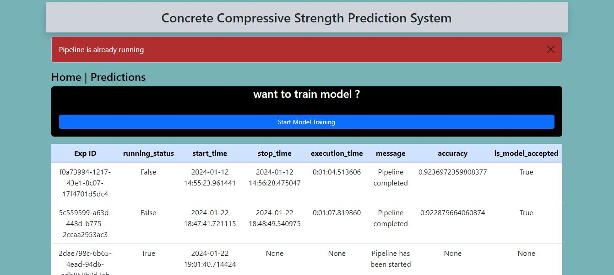

# concrete_strength_prediction
This project is an machine learning based project, where we are trying to predict the compressive strength of the concrete. we know that measuring the strength of an concrete mixture is an expensive and time taking process, to save time and expenses for this test, ML predictions can be an alternative approach. Here in this project we are taking the data and training ML models to find a model which can predict the strength of concrete.

In this project , we are performing ML experiments ( training various ml models ) to get best model and serving the best model to use as prediction service. Here user can use the web application and enter the input features of the concrete and get the predicted strength.

USER App views 

# Home Page 

# Model Training (Manual) / Experiment page

# Model Training (Manual) starting

# Model Training (Manual) running validation

# Model Prediction Page 

# Model Single Prediction

# Model All predictions

